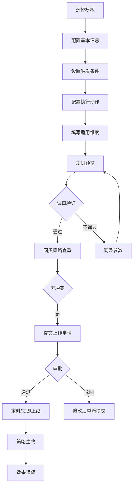

# 规则引擎自助配置门户 - 产品需求文档

## 1. 产品概述

**规则引擎自助配置门户**是一款面向客服运营和区域管理员的业务策略配置工具，通过可视化向导帮助用户快速创建、测试和上线服务策略（如折扣、提醒、派单、准入规则），实现运营策略的快速迭代与效果追踪。

- **核心价值**：降低策略配置门槛，提升运营效率，支持精细化的服务策略管理
- **目标用户**：客服运营人员、区域管理员、运营分析师
- **使用场景**：快速调整节假日促销折扣、设置用户等级提醒、配置派单规则、定义服务准入条件

## 2. 核心功能模块

### 2.1 用户角色

| 角色 | 职责 | 核心权限 |
|------|------|----------|
| 运营专员 | 创建和配置策略，提交上线申请 | 创建、编辑、提交审批、查看效果 |
| 区域管理员 | 审核和部署策略，管理区域策略 | 审批、部署、暂停、恢复、查看全部策略 |
| 系统管理员 | 系统配置和用户管理 | 全部权限，包括模板管理和系统设置 |

### 2.2 功能模块

1. **策略首页** - 策略总览、快捷入口、待办事项
2. **模板库** - 策略模板浏览、分类筛选、模板预览
3. **配置向导** - 多步骤策略配置流程
4. **试算页面** - 规则预览、样例试算、影响人数估算
5. **上线申请** - 审批流程、版本管理、定时上线
6. **效果看板** - 命中明细、效果指标、操作日志

## 3. 核心业务流程

### 3.1 策略创建与上线流程



### 3.2 策略管理生命周期

- **草稿** → **待审批** → **审批通过** → **待上线** → **已上线** → **已暂停** → **已下线**

## 4. 页面详细设计

### 4.1 策略首页

| 模块 | 功能描述 |
|------|----------|
| 顶部导航栏 | Logo、搜索框、通知、用户头像 |
| 快捷入口区 | 创建策略、试算工具、查看报表按钮 |
| 待办事项 | 待审批数量、待上线数量、即将过期策略 |
| 策略列表 | 状态筛选、搜索、分页，展示策略名称、状态、更新时间、操作 |
| 数据统计卡片 | 策略总数、命中次数、今日新增、效果评分 |

### 4.2 模板库

| 模块 | 功能描述 |
|------|----------|
| 模板分类 | 折扣类、提醒类、派单类、准入类 |
| 模板卡片 | 模板名称、描述、使用次数、创建时间 |
| 筛选排序 | 按类型、时间、热度筛选 |
| 模板详情 | 点击查看模板详情和配置示例 |

### 4.3 配置向导

| 步骤 | 内容 |
|------|------|
| Step 1: 基本信息 | 策略名称、描述、优先级、备注 |
| Step 2: 触发条件 | 用户类型、消费金额、下单时间、地区、用户等级 |
| Step 3: 执行动作 | 折扣比例、优惠金额、赠品、积分倍数 |
| Step 4: 适用维度 | 适用城市、适用时段、生效日期、排除用户 |
| Step 5: 预览确认 | 规则预览、JSON编辑、试算入口 |

### 4.4 试算页面

| 功能 | 描述 |
|------|------|
| 规则预览 | 可视化展示规则逻辑，支持JSON源码查看 |
| 样例测试 | 输入测试用户信息，验证规则匹配结果 |
| 影响人数 | 根据条件估算符合条件的用户数量 |
| 同类查重 | 检测与现有策略的冲突和重叠 |
| 试算报告 | 生成试算结果PDF/导出 |

### 4.5 上线申请

| 模块 | 功能描述 |
|------|----------|
| 申请表单 | 选择审批人、填写上线理由、设置生效时间 |
| 审批历史 | 展示审批流程、审批人意见 |
| 版本管理 | 查看历史版本、对比差异、回滚 |
| 定时设置 | 选择定时上线时间、循环模式 |

### 4.6 效果看板

| 模块 | 功能描述 |
|------|----------|
| 概览统计 | 命中率、转化率、ROI、时间趋势图 |
| 命中明细 | 查询策略的详细命中记录 |
| 效果指标 | 按维度分析策略效果（城市、人群、时间） |
| 操作日志 | 记录所有操作人和操作时间 |
| 导出功能 | 支持导出Excel、PDF报表 |

## 5. 设计风格

### 5.1 视觉风格

- **主题**：专业、清晰、高效的企业级控制台风格
- **配色方案**：
  - 主色：#2563EB（科技蓝）
  - 辅助色：#10B981（成功绿）、#F59E0B（警告黄）、#EF4444（错误红）
  - 背景色：#F8FAFC（浅灰白）、#FFFFFF（纯白卡片）
  - 文字色：#1E293B（主文字）、#64748B（次要文字）
- **圆角**：8px 统一圆角
- **阴影**：柔和阴影 (0 1px 3px rgba(0,0,0,0.1))
- **字体**：思源黑体（中文）、Inter（英文）
- **图标**：Lucide Icons（线性风格）

### 5.2 布局结构

- **整体布局**：左侧导航 + 右侧内容区
- **导航**：固定左侧，宽 240px，深色背景
- **内容区**：自适应宽度，最大 1440px，居中布局
- **卡片间距**：24px
- **响应式**：支持 1440px+、1024px、768px 断点

### 5.3 交互动效

- 页面切换：淡入淡出 300ms ease-out
- 按钮悬停：scale(1.02) + 阴影加深
- 表单验证：红色边框 + 抖动动画
- 数据加载：骨架屏占位
- 步骤切换：滑动动画

## 6. 数据模型

### 6.1 策略实体

```
策略 (Strategy)
├── 基本信息：ID、名称、描述、类型、优先级、状态
├── 触发条件：用户类型、消费门槛、时间范围、地区、用户等级
├── 执行动作：动作类型、参数配置、执行顺序
├── 适用维度：城市列表、生效时段、排除条件
├── 审批信息：审批人、审批状态、审批意见
├── 版本信息：版本号、创建时间、创建人
└── 效果数据：命中次数、转化率、ROI
```

### 6.2 操作日志

```
操作日志 (AuditLog)
├── 操作类型：创建、编辑、提交、审批、上线、暂停
├── 操作人：用户ID、用户名
├── 操作时间
├── 操作内容：变更前后对比
└── 关联策略：策略ID
```

## 7. 非功能性需求

- **性能**：页面加载 < 2s，接口响应 < 500ms
- **可用性**：支持 IE11+、Chrome、Firefox、Safari
- **安全性**：操作日志完整、操作人身份验证
- **扩展性**：支持策略数量线性扩展至 10000+
