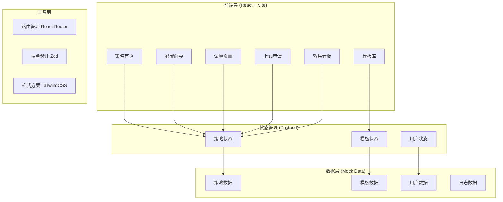

# 规则引擎自助配置门户 - 技术架构文档

## 1. 架构设计

### 1.1 整体架构



### 1.2 技术栈

| 层级 | 技术选型 | 说明 |
|------|----------|------|
| 框架 | React 18 | 函数式组件 + Hooks |
| 构建工具 | Vite 5 | 快速开发服务器和打包 |
| 路由 | React Router DOM 6 | SPA 路由管理 |
| 状态管理 | Zustand | 轻量级状态管理 |
| 表单处理 | React Hook Form | 高性能表单处理 |
| 表单验证 | Zod | TypeScript 原生验证 |
| 样式方案 | Tailwind CSS 3 | 原子化 CSS |
| 图表库 | Recharts | 数据可视化 |
| 图标 | Lucide React | 线性图标库 |
| 日期处理 | Day.js | 轻量级日期库 |

## 2. 路由定义

| 路由 | 页面 | 描述 |
|------|------|------|
| / | /dashboard | 策略首页（默认） |
| /templates | /templates | 模板库 |
| /wizard | /wizard | 配置向导 |
| /wizard/:templateId | /wizard/:templateId | 基于模板的配置向导 |
| /trial | /trial | 试算页面 |
| /apply | /apply | 上线申请 |
| /apply/:strategyId | /apply/:strategyId | 策略上线申请 |
| /analytics | /analytics | 效果看板 |

## 3. 页面结构

```
src/
├── components/           # 通用组件
│   ├── Layout/          # 布局组件
│   ├── Common/          # 通用UI组件
│   └── Forms/           # 表单组件
├── pages/               # 页面组件
│   ├── Dashboard/       # 策略首页
│   ├── Templates/       # 模板库
│   ├── Wizard/          # 配置向导
│   ├── Trial/           # 试算页面
│   ├── Apply/            # 上线申请
│   └── Analytics/       # 效果看板
├── stores/              # 状态管理
├── hooks/               # 自定义Hooks
├── utils/               # 工具函数
├── data/                # Mock数据
├── types/               # TypeScript类型定义
└── styles/              # 全局样式
```

## 4. 核心组件设计

### 4.1 布局组件 (Layout)

```
Layout
├── Sidebar              # 左侧导航
│   ├── Logo
│   ├── NavMenu          # 导航菜单
│   └── UserInfo         # 用户信息
├── Header               # 顶部栏
│   ├── SearchBar
│   ├── Notifications
│   └── UserDropdown
└── MainContent          # 主内容区
```

### 4.2 页面组件

#### Dashboard (策略首页)
- StatisticsCards：统计卡片组件
- QuickActions：快捷操作按钮
- TodoList：待办事项列表
- StrategyTable：策略列表表格

#### Templates (模板库)
- TemplateFilter：筛选组件
- TemplateGrid：模板卡片网格
- TemplateCard：单个模板卡片
- TemplateDetail：模板详情弹窗

#### Wizard (配置向导)
- StepIndicator：步骤指示器
- BasicInfoForm：基本信息表单
- TriggerForm：触发条件表单
- ActionForm：执行动作表单
- DimensionForm：适用维度表单
- RulePreview：规则预览组件

#### Trial (试算页面)
- RulePreview：规则预览
- SampleTest：样例测试表单
- ImpactEstimator：影响人数估算
- DuplicateChecker：同类查重

#### Apply (上线申请)
- ApprovalForm：审批表单
- VersionHistory：版本历史
- Timeline：审批时间线

#### Analytics (效果看板)
- OverviewCharts：概览图表
- HitDetails：命中明细表
- MetricsPanel：效果指标面板
- AuditLog：操作日志

## 5. 数据模型

### 5.1 TypeScript 类型定义

```typescript
// 策略状态枚举
type StrategyStatus = 'draft' | 'pending' | 'approved' | 'pending_launch' | 'active' | 'paused' | 'disabled';

// 策略类型枚举
type StrategyType = 'discount' | 'reminder' | 'dispatch' | 'admission';

// 策略接口
interface Strategy {
  id: string;
  name: string;
  description: string;
  type: StrategyType;
  priority: number;
  status: StrategyStatus;
  trigger: TriggerCondition;
  action: ActionConfig;
  dimensions: DimensionConfig;
  creator: string;
  createTime: string;
  updateTime: string;
  approver?: string;
  approveTime?: string;
  launchTime?: string;
  stats?: StrategyStats;
}

// 触发条件
interface TriggerCondition {
  userTypes?: string[];
  minAmount?: number;
  maxAmount?: number;
  startTime?: string;
  endTime?: string;
  cities?: string[];
  userLevels?: string[];
}

// 执行动作
interface ActionConfig {
  actionType: 'discount' | 'gift' | 'points' | 'coupon';
  discountType?: 'percentage' | 'fixed';
  discountValue?: number;
  giftName?: string;
  pointsMultiplier?: number;
}

// 适用维度
interface DimensionConfig {
  cities: string[];
  timeSlots: TimeSlot[];
  excludeUsers?: string[];
  effectiveStart?: string;
  effectiveEnd?: string;
}

// 统计数据
interface StrategyStats {
  hitCount: number;
  hitRate: number;
  conversionRate: number;
  roi: number;
}

// 模板
interface Template {
  id: string;
  name: string;
  description: string;
  type: StrategyType;
  usageCount: number;
  createTime: string;
  thumbnail?: string;
}

// 操作日志
interface AuditLog {
  id: string;
  strategyId: string;
  action: string;
  operator: string;
  operatorName: string;
  createTime: string;
  details?: string;
  beforeState?: object;
  afterState?: object;
}
```

## 6. Mock 数据结构

```typescript
// 模拟策略数据
export const mockStrategies: Strategy[] = [
  {
    id: '1',
    name: '新用户首单8折优惠',
    description: '针对新注册用户提供首单8折优惠',
    type: 'discount',
    priority: 1,
    status: 'active',
    // ... 其他字段
  },
  // 更多策略
];

// 模拟模板数据
export const mockTemplates: Template[] = [
  {
    id: '1',
    name: '折扣促销模板',
    type: 'discount',
    // ...
  },
  // 更多模板
];

// 模拟统计数据
export const mockStats = {
  totalStrategies: 156,
  activeStrategies: 89,
  todayNew: 5,
  totalHits: 125680,
};
```

## 7. 关键交互设计

### 7.1 配置向导步骤流程

```
1. 选择模板/从零创建
   ↓
2. 填写基本信息（名称、描述、优先级）
   ↓ 表单验证通过后下一步
3. 配置触发条件（用户类型、金额、时间等）
   ↓ 至少配置一个条件
4. 配置执行动作（折扣、赠品等）
   ↓
5. 设置适用维度（城市、时段、有效期）
   ↓
6. 规则预览 + 试算入口
   ↓
7. 提交审批 / 保存草稿
```

### 7.2 试算功能逻辑

```typescript
// 试算函数
function trialCalculate(strategy: Strategy, testData: TestData): TrialResult {
  // 1. 检查触发条件是否满足
  const triggerMatch = checkTrigger(strategy.trigger, testData);
  
  // 2. 检查适用维度
  const dimensionMatch = checkDimension(strategy.dimensions, testData);
  
  // 3. 计算影响人数
  const impactCount = estimateImpact(strategy);
  
  // 4. 检测同类策略冲突
  const conflicts = findConflicts(strategy);
  
  return {
    matched: triggerMatch && dimensionMatch,
    triggerResult: triggerMatch,
    dimensionResult: dimensionMatch,
    impactCount,
    conflicts,
  };
}
```

## 8. 响应式断点

| 断点 | 宽度 | 布局变化 |
|------|------|----------|
| Desktop | 1440px+ | 完整布局，导航全展开 |
| Laptop | 1024px - 1439px | 导航收起为图标 |
| Tablet | 768px - 1023px | 导航变为顶部汉堡菜单 |
| Mobile | < 768px | 单列布局，简化操作 |

## 9. 性能优化策略

- 路由懒加载：使用 React.lazy 实现页面级代码分割
- 状态优化：使用 Zustand 的 selector 减少不必要的渲染
- 虚拟列表：长列表使用 react-window 优化
- 缓存策略：模板和策略列表使用 localStorage 缓存
- 骨架屏：数据加载时显示骨架屏占位

## 10. 项目初始化命令

```bash
# 创建 Vite 项目
npm create vite@latest rule-engine-portal -- --template react-ts

# 安装依赖
npm install

# 安装路由
npm install react-router-dom

# 安装状态管理
npm install zustand

# 安装表单处理
npm install react-hook-form zod @hookform/resolvers

# 安装 Tailwind CSS
npm install -D tailwindcss postcss autoprefixer
npx tailwindcss init -p

# 安装图表库
npm install recharts

# 安装图标
npm install lucide-react

# 安装日期处理
npm install dayjs
```
